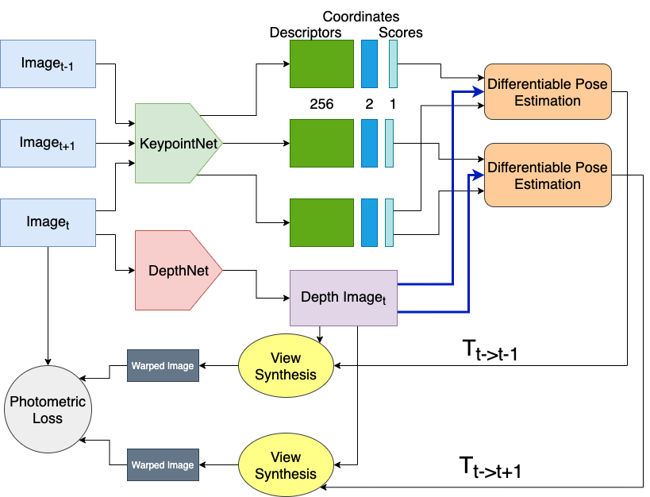
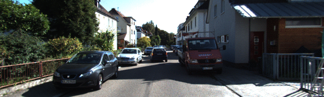
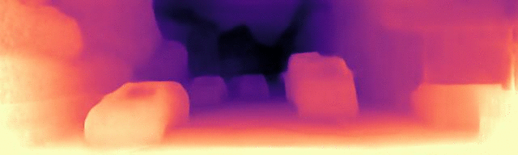

# PriorDepth

This project aims to build a fully differentiable network for unsupervised depth and ego motion estimation from video sequences using spatial and temporal priors with unsupervised keypoint learning. This work was done as part of the Master Practical course on [Advanced Topics in 3D Computer Vision](http://campar.in.tum.de/Chair/TeachingSoSe21AT3DCV ) advised by [M.Sc Patrick Ruhkamp](http://campar.in.tum.de/Main/PatrickRuhkamp).

It combines the KeyPointNet from [KP2D](https://github.com/TRI-ML/KP2D) and the DepthNet from [MonoDepth2](https://github.com/nianticlabs/monodepth2) to simultaneously estimate the depth map and relative pose between subsequent frames of the video. To make the network end to end differentiable to train with backward propogating gradients, [Kornia](https://kornia.github.io/) was used to implement PnP and Essential Matrix based pose calculations. This network is loosely based on network proposed by [KP3D](https://github.com/TRI-ML/KP3D).

The schematic flow of the network is shown below for both the PnP based pose estimators

<p align="middle">
   
</p>

### Additional Visualisations

The following graphics show the performance of DepthNet from the MonoDepth2 on the KITTI sequences.
<p align="center">
  
   
</p>

This set of graphics show the performance of the keypoint matching filters implemented to provide robust descriptors and matching for the process of pose estimation.
<p align="center">
  
   
</p>


### Training Setup
For training the network, setup the configuration in ```KP3D_baseline/options.py``` and start the training with ```KP3D_baseline/main.py```


More details are available in the presentations. Feel free to check them out!
